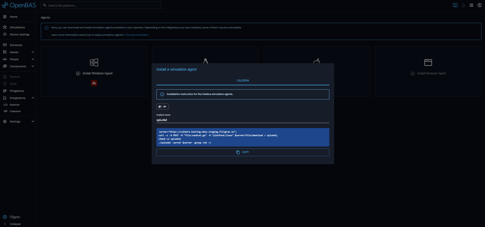

# Injectors

Injectors serve as the backbone of the platform, enabling essential integration and functionalities for conducting simulations and exercises effectively. These components empower administrators to orchestrate a diverse range of activities and responses during simulation scenarios. Some of them are built-in in the platform, and others are external integrations. 

Built-in injectors are seamlessly integrated into the platform, while external injectors require the deployment of additional systems alongside the platform to enable their functionality. Together, these injectors provide a comprehensive toolkit for administrators to design and execute simulations tailored to their specific objectives and requirements.

## Injectors list

A multitude of injectors are available, each offering distinct capabilities and functionalities to enhance the simulation experience. Here is an overview of the existing injectors:

- Airbus CyberRange (Lade): Integration with the Airbus CyberRange platform, enabling seamless interaction and collaboration with CyberRange environments. For more information concerning CyberRange, please refer to the [Airbus website](https://www.cyber.airbus.com/cyberrange/).
- Caldera: Facilitates the use of the MITRE Caldera framework, empowering administrators to leverage advanced simulation capabilities. For more information concerning the Caldera injector, please refer to the [dedicated documentation page](inject-caldera.md).
- Challenges: Manages inject "publish challenges". To find more information more about this type of inject, please refer to the [dedicated documentation section](injects.md#challenge-section).
- Email: Manages the sending of injects' emails, enabling communication and dissemination of simulation-related information.
- HTTP query: Executes HTTP requests on external services, facilitating interactions with external systems. To find more information about the related inject, please refer to the [dedicated documentation section](injects.md#http-section).
- Manual: Platform functionality for creating manual action reminders, allowing administrators to prompt specific actions to be performed manually. To find more information about the related inject, please refer to the [dedicated documentation section](injects.md#manual-section).
- Media pressure: Manages inject "publish channel pressure". To find more information about this type of inject, please refer to the [dedicated documentation section](injects.md#media-pressure-section).
- OVHCloud SMS Platform: Facilitates SMS messaging for injects, providing an additional communication channel for simulation participants.
- OpenCTI: Integration with an OpenCTI platform, enhancing simulation capabilities with access to threat intelligence and [automatic scenario generation](opencti_scenario.md) based on observed threat activities.

## Agents

For certain injectors, deploying an agent on the target machine is necessary to facilitate integration with OpenBAS. These agents are software programs that connect back to OpenBAS at certain intervals to get instructions.

To access the agents and installation instructions, navigate to the dedicated page located in the top right-hand corner (button with the screen logo). 

Detailed guidance on installing the agents, along with downloadable packages, is provided on this page. Agents are available for various operating systems, including Windows, Linux, and MacOS, ensuring compatibility across different environments. 

As of now, only the Caldera injector requires the installation of an agent. This agent enables full integration with the MITRE Caldera framework, unlocking advanced simulation capabilities and enhancing the overall effectiveness of simulation exercises. Full details of the [Caldera agent](https://caldera.readthedocs.io/en/latest/Learning-the-terminology.html#agents) are available in the MITRE documentation.

