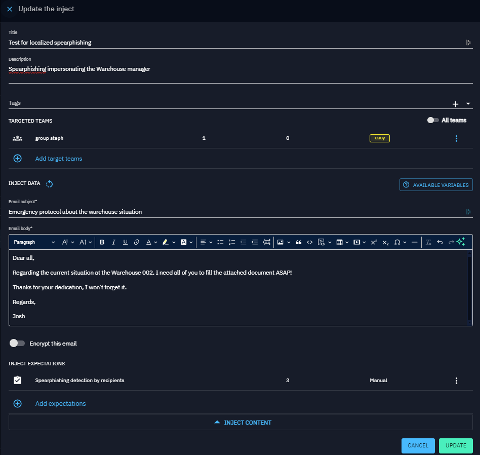
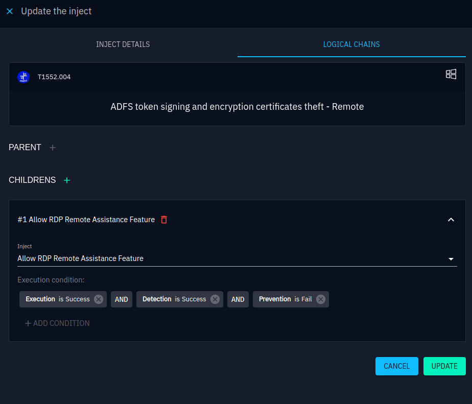

# Injects and Expectations

Evaluating security posture in OpenBAS is to confront events (aka [Injects](injects.md)) with [Expectations](expectations.md).

## Injects

Threats are the results of actions by threat actors, and a combination of intent, capability and opportunity. In OpenBAS, simulating threats and their attack capabilities involves executing injects targeting [players](teams_and_players_and_organizations.md) and [assets](assets.md).

Injects can be technical, emulating action attackers might take on an endpoint, and non-technical, representing interactions with players or impactful contextual events during a crisis (such as media inquiries by phone following a data breach). They are always triggered at a specific point in time but it is possible to execute them only if one or multiple conditions are met.

## Expectations

Each Inject is associated with Expectations. Expectations outline the anticipated outcomes from security systems and teams in response to attacker actions or contextual events.

Expectations can be about:

- Prevention: ensuring that the security posture can prevent the attacker's actions.
- Detection: ensuring that the security posture can detect the attacker's actions.
- Human response: ensuring that teams react appropriately according to defined security processes.

The collection and concatenation of expectations' results, broken down per type, allows to assess the security posture against a threat context. This provides insights to identify areas for improvement. Expectations can also be used as conditions for the execution of other injects.
