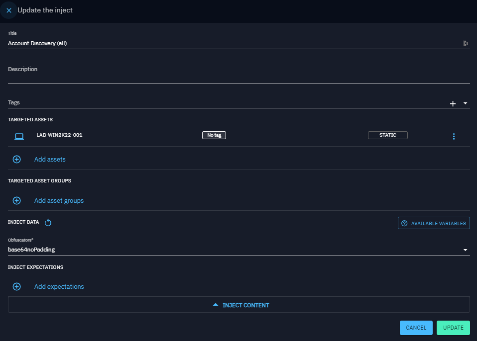

# Injects and Expectations

!!! tip "Under construction"

    We are doing our best to complete this page. If you want to participate, don't hesitate to join the [Filigran Community on Slack](https://community.filigran.io) or submit your pull request on the [Github doc repository](https://github.com/OpenBAS-Platform/docs).

Evaluating security posture in OpenBAS is to confront events (Injects) with Expectations.

## Injects

Threats are the results of actions by threat actors, and a combination of Intent, Capability and Opportunity. Simulating threats and their attack capability in OpenBAS is done by playing Injects against Players and Assets.

Injects can be technical, to simulate action an attacker can perform on an endpoint for example, but also non-technical to represent action against Player or impactful contextual events during a crisis (a call from a media after a data leak)

## Expectations

Each Inject is associated with Expectations. Expectations represent what is expected from a security systems and teams against the attacker action or contextual events. 

Expectations can be about:
- Prevention: facing this event, I expect my security posture to be able to prevent the attacker action
- Detection: facing this event, I expect my security posture to be able to detect the attacker action
- Human response: facing this event, I expect my teams to be able to react accordingly to my defined security process.

The collectation and concatenation of expectations' results, broken down per type, allows to assess the security posture against a threat context, and offer the ability to pin point areas of improvement.

