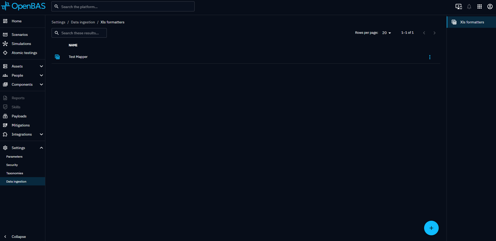
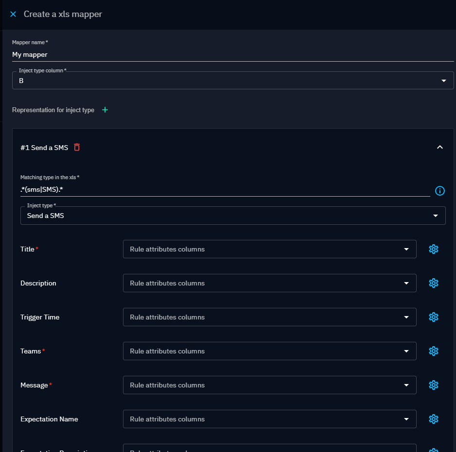
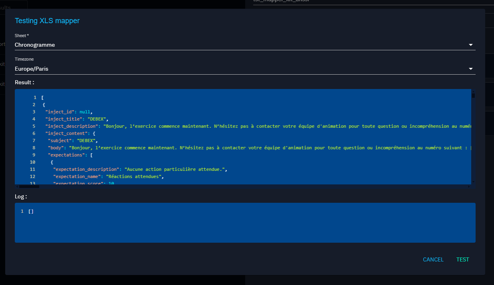

# Importing Injects into a Scenario

Recreating a timeline of [injects](injects.md) that were already defined in a spreadsheet can be a frustrating task. To help users save time, we added the possibility to import injects as defined in an xls file into a [scenario](scenario.md). This is done via a two-steps process : [creating a mapper](#how-to-create-a-mapper) and [importing the xls file using the mapper](#how-to-import-injects-into-a-scenario-using-a-mapper).

## How to create a mapper ?

First of all, to import [injects](injects.md) into a [scenario](scenario.md), you need to create a mapper. To do that, using an admin account, navigate to the Settings > Data ingestion page. You will then be able to see a list of all the mappers but also to create new ones by clicking on the "+" button on the bottom right of the screen.

### Setting up the mapper to tell each injects apart 

When creating a new mapper, you will quickly be asked to choose an inject type column. This column is the one that will allow the mapper to figure out which injects to create (Sending a mail, sending an sms, ...). Once this column has been chosen, you can add a representation for an inject type. 

The first thing to define in this representation is the matching type in the xls. This is the value that will define which inject to create when scanning the column defined in "inject type column". For instance, if you want to create an inject that sends individual emails when in the column there is the word "mail", then you will need to set the value as "mail". You can also make use of [regular expressions](https://en.wikipedia.org/wiki/Regular_expression) in this field. Please keep in mind though that this value is case sensitive. 

Once that is done, you can select the inject type among a list of [injects](injects.md) that are compatible with the xls import. When that selection is done, you will be able to set a column for each of the attribute that can be completed using the import. If you wish to set a default value you can do so by clicking the gear on the right side of the field.

### Properly setting the trigger time of the inject
It should also be noted that the "Trigger Time" field has a second parameter that can be set using the gear button. It can be used to set a custom format for specific dates and or time to be interpreted. The complete format rules are available [here](https://docs.oracle.com/javase/8/docs/api/java/time/format/DateTimeFormatter.html) but here is a very quick overview :

| Symbol    | Meaning               | Presentation  | Examples  |
|-----------|-----------------------|---------------|-----------|
| y         | year-of-era           | year          | 2004; 04  |
| M/L       | month-of-year         | number/text   | 7; 07; Jul; July; J |
| d         | day-of-month          | number        | 10        |
| a         | am-pm-of-day          | text          | PM        |
| h         | clock-hour-of-am-pm (1-12) | number   | 12        |
| H         | hour-of-day (0-23)    | number        | 0         |
| m         | minute-of-hour        | number        | 30        |
| s         | second-of-minute      | number        | 55        |
| '         | escape for text       | delimiter     |           |
| ''        | single quote          | literal       | '         |
| [         | optional section start|               |           |
| ]         | optional section end  |               |           |

Please, do note that if you wish to use exact time of the day (e.g. 9:30) in your trigger time, you will need to set a launch date on your scenario before importing the timeline of injects from the xls file.

You can also decide to use relative dates for each injects. For instance, you can say that your first inject happens at T and that subsequent injects happens at T+x. If so, you can set relative dates using the following values :

| Symbol    | Meaning               |
|-----------|-----------------------|
| D         | Day                   |
| J         | Day                   |
| H         | Hour                  |
| T         | Hour                  |
| M         | Minutes               |

This means that if you want your inject to start 2 days, 3 hours and 45 minutes after the start of your scenario, you can set the trigger time to D+2 H+3 M+45. When using relative dates, you do not need to define a pattern for the trigger time field.

Once you have set all fields you wish to set, you can click on the create button if you wish to create your mapper but you can also click on the test button to check that it works as intended.

### Testing the mapper
If you click on the test button, you'll then be asked to choose a file. Once that is done, you will have to select the sheet to test out of the spreadsheet and the timezone. You will then be able to click on Test to have the result field filled as well as a list of the messages generated during the import (those are not saved, and are just there to help figure out what happened during the import itself).

## How to import injects into a scenario using a mapper ?

Once your mapper has been created, navigate to your [scenario](scenario.md) and then to the [injects](injects.md) tab. There, you will be able to click on an import button on the top right.
A modal will be opening, inviting you to select an .xls/.xlsx file. Once it has been selected, you can click on next. You will then be asked to choose the sheet to import out of the spreadsheet and to select the mapper to use. You will also be able to select the timezone to use for the import. Once everything is set, click on the launch import button and your injects will be imported into the current scenario !
Please do not that if all the dates in the xls file are absolute time of the day (e.g. 9:30, 12:45, ...), it is required for the scenario to have a launch date set.